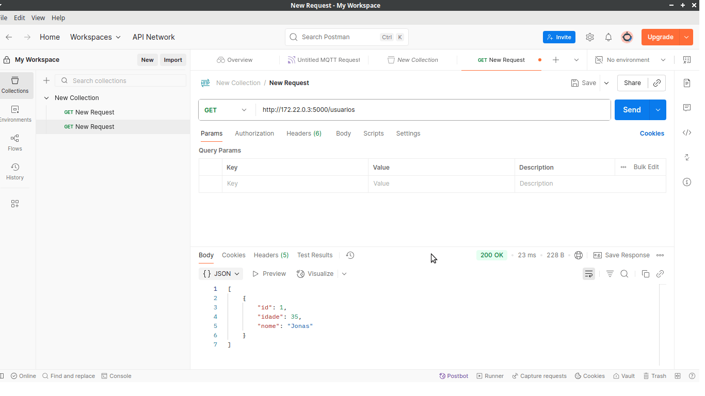
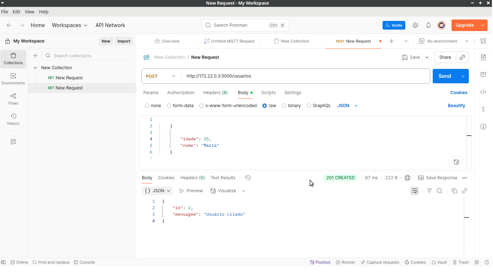

# Atividade da disciplina de GCSI que consiste na criação de dockerfiles para rodar uma aplicação flask

## Etapa 1:
- primeiro você tem que criar os 2 dockerfiles, 1 para a aplicação flask e o outro para o banco de dados:

```
FROM python:3.11-slim

WORKDIR /app

COPY app/ .

RUN pip install --no-cache-dir -r requirements.txt

EXPOSE 5000

CMD ["python3", "app.py"]


FROM postgres:15-alpine

ENV POSTGRES_USER=postgres
ENV POSTGRES_PASSWORD=123456
ENV POSTGRES_DB=atv4

EXPOSE 5432

``` 

## Etapa 2:
- criar a rede para aconteça a comunicação:
```
docker network create minha-rede
```
## Etapa 3:
- Criar a imagem do banco:

```
 docker build -t db  -f postgres/postgres.Dockerfile .
```

## Etapa 4: 
- criar o container do banco de dados:
```
docker run --name postgres_container --network minha-rede \
  -e POSTGRES_PASSWORD=123456 \
  -e POSTGRES_DB=atv4 \
  -p 5432:5432 \
  -d postgres
```


## Etapa 5:
- criar a imagem da aplicação:
```
 docker build -t flask-app -f app/python.Dockerfile .
```

## Etapa 6:
- criar o container:
```
docker run -d --name flask_app --network minha-rede -p 5000:5000 flask-app

```
## Etapa 7:
- utilizando o comando a seguir, você confirma se esta executando ou não a aplicação, se der certo irá aparecer a aplicação rodando com a url:

```
docker logs flask_app
```

## Etapa 8:
- teste dos endpoints POST e GET:




